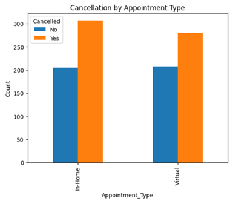
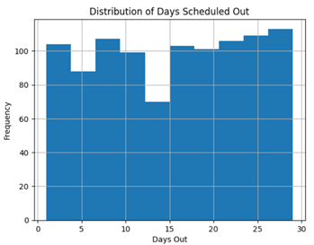
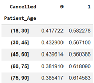
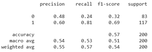

# Healthcare Appointment Analytics

## Project Overview

This project analyzes healthcare appointment scheduling and cancellation behavior using exploratory data analysis, statistical modeling, and machine learning techniques.

The analysis focuses on identifying operational trends, cancellation patterns, and predictive relationships that may support healthcare scheduling optimization and business decision-making.

---

## Technologies Used

- Python
- Pandas
- NumPy
- Matplotlib
- Scikit-learn
- SciPy
- Google Colab

---

## Analytical Techniques

- Exploratory Data Analysis (EDA)
- Statistical Analysis
- Data Visualization
- Feature Engineering
- Random Forest Classification
- Predictive Modeling

---

## Key Insights

- Cancellation behavior varied across operational and scheduling variables.
- Structural patterns were identified within appointment scheduling behavior.
- Machine learning models demonstrated measurable predictive capability for broader scheduling outcomes.
- Feature importance analysis identified the strongest operational drivers influencing appointment outcomes.

---

## Repository Structure

```text
notebooks/   -> Jupyter notebooks
reports/     -> Executive reports
images/      -> Project visualizations
data/        -> Datasets
```

---

## Sample Visualizations

### Cancellation by Appointment Type



This visualization compares cancellation behavior across appointment types and highlights differences between in-home and virtual scheduling outcomes.

---

### Distribution of Days Scheduled Out



This histogram illustrates the distribution of appointment scheduling lead times across the dataset.

---

### Patient Age Segmentation and Cancellations



This analysis evaluates cancellation behavior across segmented patient age groups.

---

### Random Forest Feature Importance


Feature importance analysis identified the strongest predictive variables influencing appointment cancellation behavior.

---

### Random Forest Classification Report



The Random Forest model demonstrated measurable predictive capability when classifying appointment cancellation outcomes.

---

## Author

Jose Reyes  
MS Business Analytics & Artificial Intelligence  
University of Texas Rio Grande Valley
